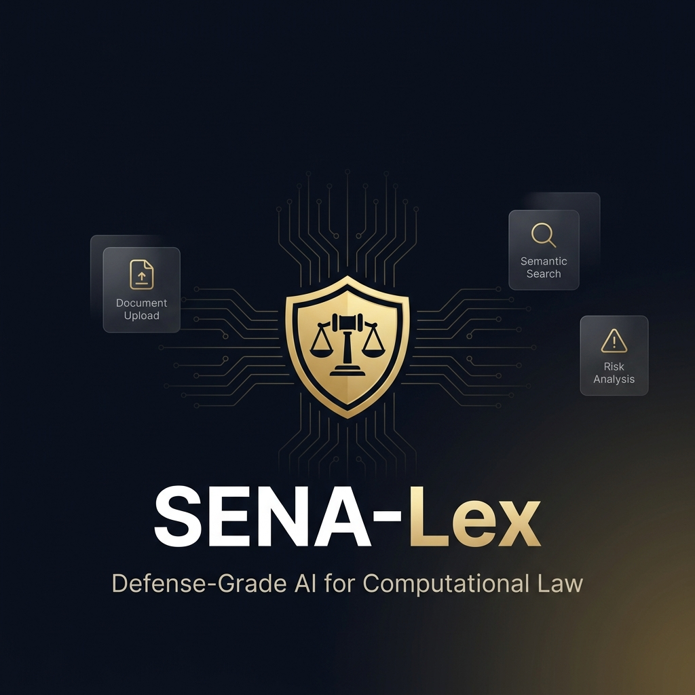
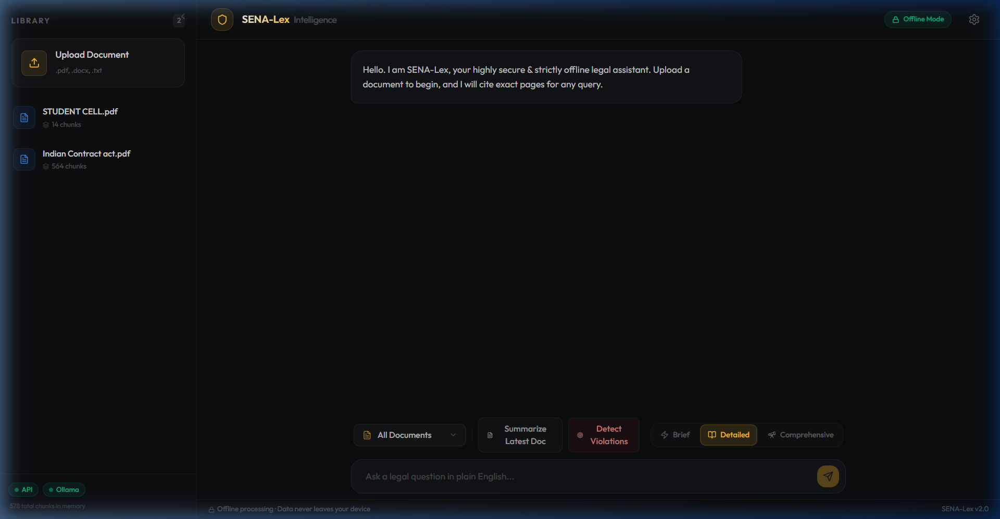

<p align="center">
  
</p>

<h1 align="center">SENA-Lex</h1>
<h3 align="center">Offline Defense-Grade AI for Computational Law</h3>

<p align="center">
  
  
  
  
  
  
</p>

<p align="center">
  <b>An AI-powered legal document analysis platform that runs 100% offline.</b><br/>
  Semantic search · Risk detection · Anti-hallucination verification · Zero cloud dependency.
</p>

---

<p align="center">
  
</p>

---

## ✨ Why SENA-Lex?

Legal professionals handle **highly confidential** contracts, NDAs, and litigation documents every day. Existing AI tools require uploading these documents to third-party servers — a non-starter for privileged legal work.

**SENA-Lex solves this** by running a full NLP intelligence stack locally on your machine. No API keys. No cloud uploads. No data leaks. Ever.

---

## 🏗️ Architecture

```
┌──────────────────────────────────────────────────────────────────┐
│                        SENA-Lex Platform                         │
├───────────────┬──────────────────────────┬───────────────────────┤
│   Frontend    │       Backend API        │     AI Engine         │
│   React 19    │       FastAPI            │     Ollama            │
│   Vite 8      │       Python 3.10+       │     Mistral 7B        │
│   Tailwind 4  │       FAISS + BM25       │     Local GGUF        │
│   Framer      │       NetworkX           │     4-bit Quantized   │
│   Motion      │       sentence-xformers  │     Zero Cloud        │
└───────────────┴──────────────────────────┴───────────────────────┘
                              │
                    ┌─────────┴──────────┐
                    │    Docker Compose   │
                    │   One-Click Deploy  │
                    └────────────────────┘
```

---

## 🚀 Features

### 🔒 Defense-Grade Privacy
| Feature | Description |
|---------|-------------|
| **100% Offline** | All AI inference runs locally via Ollama — zero network calls |
| **Local Vector Store** | FAISS indices stored on-disk, never transmitted |
| **No API Keys** | No OpenAI, Anthropic, or cloud dependency |
| **Docker Isolated** | Optional containerized deployment for air-gapped environments |

### 🧠 Advanced RAG Pipeline
| Feature | Description |
|---------|-------------|
| **Hybrid Search** | Fuses FAISS dense vectors + BM25 sparse retrieval for precision |
| **Knowledge Graphs** | Auto-builds entity relationship graphs via NetworkX |
| **Multi-Hop Reasoning** | Decomposes complex queries into sub-queries for deeper analysis |
| **Semantic Chunking** | Intelligently splits documents into searchable paragraph clusters |

### ⚖️ Legal Intelligence
| Feature | Description |
|---------|-------------|
| **Risk Detection** | Scans contracts for hidden liabilities, punitive clauses, and compliance violations |
| **Confidence Scoring** | Multi-dimensional confidence engine (5 metrics: retrieval relevance, faithfulness, agreement, citation & query coverage) |
| **Anti-Hallucination** | Mandatory verification trace audits every AI response against source documents |
| **Document Summarization** | One-click 3-sentence summaries of any uploaded legal document |
| **Contract Comparison** | Differential analysis endpoint comparing obligations across two documents |

### 🎨 Premium UI/UX
| Feature | Description |
|---------|-------------|
| **Dark Glassmorphism** | Premium dark theme with noise texture, glass panels, and gold accents |
| **Risk Heatmaps** | Color-coded risk distribution with filterable clause cards (High/Medium/Low) |
| **Response Modes** | Choose between Brief ⚡, Detailed 📖, or Comprehensive 🔭 answer depth |
| **Streaming Responses** | Real-time SSE token streaming with shimmer loading animations |
| **Collapsible Sidebar** | Animated sidebar with document library, upload zone, and system status |
| **Source Attribution** | Clickable citation cards linking directly to document pages |

---

## 📦 Quick Start

### Prerequisites

- **Python 3.10+**
- **Node.js 18+**
- **Ollama** ([install here](https://ollama.com))

### 1. Clone the Repository

```bash
git clone https://github.com/rishavgsv/SENA-Lex-Offline-Defense-Grade-AI-for-Computational-Law.git
cd SENA-Lex-Offline-Defense-Grade-AI-for-Computational-Law
```

### 2. Setup Backend

```bash
cd backend

# Create virtual environment
python -m venv venv
source venv/bin/activate        # Linux/Mac
# venv\Scripts\activate          # Windows

# Install dependencies
pip install -r requirements.txt

# Download the embedding model
python download_embeddings.py

# Download & import the LLM into Ollama
python download_model.py
ollama create sena-lex-mistral -f Modelfile
```

### 3. Setup Frontend

```bash
cd ../frontend
npm install
```

### 4. Launch

```bash
# Terminal 1: Start Ollama
ollama serve

# Terminal 2: Start Backend
cd backend
uvicorn app.main:app --reload --port 8000

# Terminal 3: Start Frontend
cd frontend
npm run dev
```

Open **http://localhost:5173** — you're ready to go. 🎉

### 🐳 Docker (Alternative)

```bash
docker-compose up --build
```

---

## 🖥️ Usage Guide

### Upload & Index
1. Click **Upload Document** in the sidebar (or drag & drop)
2. Supported formats: `.pdf`, `.docx`, `.txt`
3. Watch the real-time indexing progress bar
4. Document chunks are stored in the local FAISS vector store

### Ask Questions
1. Select a document (or search all)
2. Choose a response mode: **Brief** / **Detailed** / **Comprehensive**
3. Type your question and hit send
4. AI streams the answer with source citations and confidence scoring

### Detect Risks
1. Click **Detect Violations** in the action bar
2. AI scans for liabilities, penalties, and compliance issues
3. Risk panel slides in with color-coded clause cards
4. Filter by severity: High 🔴 / Medium 🟡 / Low 🟢

---

## 📁 Project Structure

```
SENA-Lex/
├── backend/
│   ├── app/
│   │   ├── main.py              # FastAPI routes & endpoints
│   │   ├── llm.py               # Ollama LLM integration & streaming
│   │   ├── vector_store.py      # FAISS + BM25 hybrid search engine
│   │   ├── confidence_engine.py # Multi-dimensional confidence scoring
│   │   ├── graph_engine.py      # NetworkX knowledge graph builder
│   │   ├── ingest.py            # Document parsing (PDF/DOCX/TXT)
│   │   └── schemas.py           # Pydantic request/response models
│   ├── Modelfile                # Ollama model configuration
│   ├── Dockerfile               # Backend container
│   └── requirements.txt         # Python dependencies
├── frontend/
│   ├── src/
│   │   ├── App.jsx              # Main app shell with animated panels
│   │   ├── index.css            # Design system tokens & utilities
│   │   ├── components/
│   │   │   ├── ChatInterface.jsx # Chat UI, confidence, response modes
│   │   │   ├── Sidebar.jsx       # Document library & system status
│   │   │   └── PDFViewer.jsx     # Risk panel with heatmap & filters
│   │   └── main.jsx             # React entry point
│   ├── index.html               # HTML shell with SEO meta tags
│   └── package.json             # Frontend dependencies
├── docker-compose.yml           # One-click orchestration
├── docs/                        # Documentation & media assets
└── README.md
```

---

## 🧪 Tech Stack

| Layer | Technology | Purpose |
|-------|-----------|---------|
| **LLM** | Mistral 7B (Q4_K_M GGUF) | Local language model via Ollama |
| **Embeddings** | all-MiniLM-L6-v2 | Sentence-level semantic embeddings |
| **Vector DB** | FAISS + NumPy | Dense vector similarity search |
| **Sparse Retrieval** | BM25 (rank-bm25) | Term-frequency keyword matching |
| **Knowledge Graph** | NetworkX | Entity relationship mapping |
| **Backend** | FastAPI + Uvicorn | Async API with SSE streaming |
| **Frontend** | React 19 + Vite 8 | Modern SPA with HMR |
| **Styling** | TailwindCSS 4 | Utility-first CSS framework |
| **Animations** | Framer Motion | Spring physics animations |
| **Document Parsing** | PyMuPDF + python-docx | PDF/DOCX text extraction |
| **Deployment** | Docker Compose | Multi-service orchestration |

---

## 🔐 Security Model

```
┌─────────────────────────────────────────────┐
│              Your Local Machine              │
│                                              │
│  ┌──────────┐  ┌──────────┐  ┌──────────┐  │
│  │ Frontend │◄─┤ Backend  │◄─┤  Ollama  │  │
│  │ :5173    │  │ :8000    │  │ :11434   │  │
│  └──────────┘  └──────────┘  └──────────┘  │
│                                              │
│  ✅ All data stays here                      │
│  ✅ No external API calls                    │
│  ✅ No telemetry or tracking                 │
│  ✅ Works in air-gapped environments         │
└─────────────────────────────────────────────┘
           ❌ Internet NOT required
```

---

## 🤝 Contributing

Contributions are welcome! Please feel free to submit a Pull Request.

1. Fork the repository
2. Create your feature branch (`git checkout -b feature/AmazingFeature`)
3. Commit your changes (`git commit -m 'Add some AmazingFeature'`)
4. Push to the branch (`git push origin feature/AmazingFeature`)
5. Open a Pull Request

---

## 📄 License

This project is licensed under the MIT License — see the [LICENSE](LICENSE) file for details.

---

## 👤 Author

**Rishav Kumar**

- GitHub: [@rishavgsv](https://github.com/rishavgsv)

---

<p align="center">
  <sub>Built with ❤️ for legal professionals who demand privacy.</sub><br/>
  <sub>SENA-Lex — Because your documents deserve defense-grade protection.</sub>
</p>
