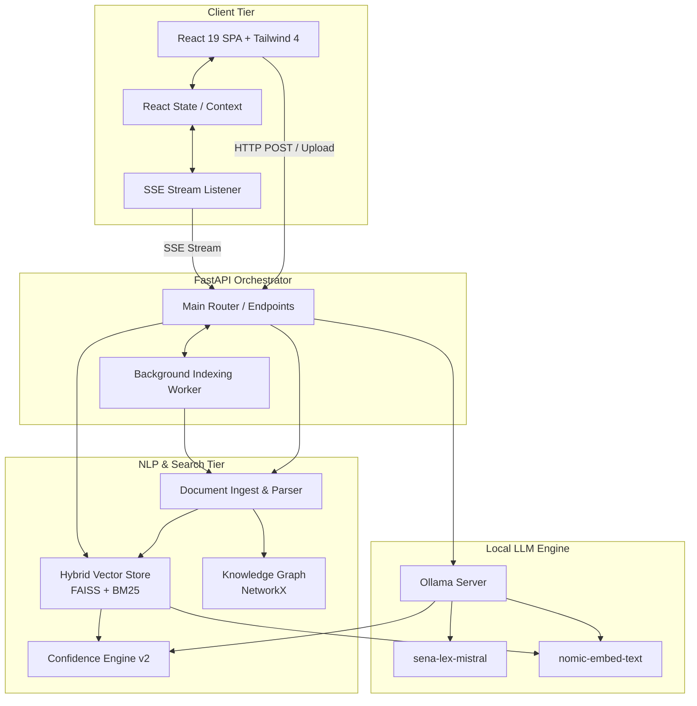
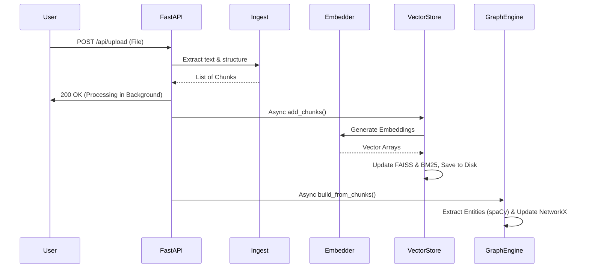
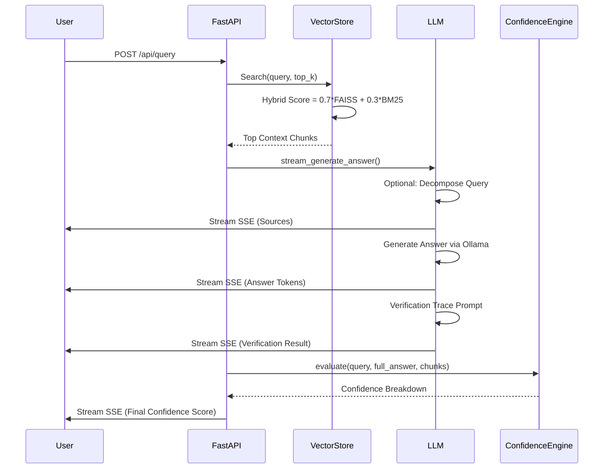

# SENA-Lex: Research-Grade Codebase Analysis & Technical Audit

## 1. Executive Summary

### Project Purpose
SENA-Lex is an offline-first, "Defense-Grade" AI platform explicitly designed for Computational Law. It provides a secure, locally-hosted environment for ingesting, semantically indexing, and querying highly sensitive legal documents (such as NDAs, contracts, and litigation files) without exposing confidential data to external cloud APIs.

### Target Users
Legal professionals, defense contractors, enterprise legal teams, and compliance officers who handle privileged information and require absolute data sovereignty, zero data leakage, and highly accurate AI-assisted document analysis.

### Core Value Proposition
- **Total Data Privacy**: 100% offline execution. No API keys, no telemetry, no cloud uploads.
- **Anti-Hallucination Framework**: Enforces a strict RAG (Retrieval-Augmented Generation) paradigm backed by a robust, mathematically rigorous 5-dimensional Confidence Engine and mandatory verification traces.
- **Legal Intelligence**: Automates risk detection (liabilities, punitive clauses, compliance violations), clause comparison, and summarization.

### Business & Technical Objectives
**Business Objective**: To eliminate the friction of adopting AI in the legal sector caused by privacy concerns and LLM hallucinations. It replaces risky public LLMs with a verifiable, secure, and auditable local system.
**Technical Objective**: To build an unbreakable link between generated answers and source texts. This is achieved by combining dense vector search (FAISS), sparse retrieval (BM25), Knowledge Graph entity mapping (NetworkX), and a local Mistral 7B model orchestrated by FastAPI and a modern React frontend.

---

## 2. System Overview

SENA-Lex employs a decoupled client-server architecture where a React 19 frontend communicates asynchronously with a FastAPI backend. The backend acts as an orchestrator for several sophisticated ML/NLP subsystems, including document ingestion, hybrid retrieval, knowledge graph construction, confidence scoring, and LLM generation via Ollama.

### Component Breakdown
- **Frontend**: React 19 SPA handling state, SSE streaming, risk heatmaps, and document visualization.
- **FastAPI Backend**: The central orchestrator managing REST and Server-Sent Events (SSE) endpoints, async background tasks, and API routing.
- **Ingestion Pipeline**: PyMuPDF/python-docx/regex-based parsers combined with spaCy for legal-aware, semantic document chunking and Named Entity Recognition (NER).
- **Hybrid Retrieval Engine**: FAISS (Dense) + BM25 (Sparse) for high-recall, high-precision context retrieval.
- **Knowledge Graph (Graph Engine)**: NetworkX-based entity-relationship mapping to enable multi-hop reasoning.
- **LLM Engine**: Local Ollama instance running `sena-lex-mistral` (Mistral 7B Q4_K_M GGUF), performing query decomposition, generation, and verification tracing.
- **Confidence Engine**: A deterministic mathematical model scoring generation against source chunks across 5 dimensions.

### High-Level Architecture Diagram



---

## 3. Repository Structure Analysis

### `backend/`
Owns the core intelligence, orchestration, and state persistence.
- `app/main.py`: The entry point. Handles API routing, CORS, background task delegation (for indexing), and SSE stream generation. It acts as the glue code between the LLM, Vector Store, and Confidence Engine.
- `app/llm.py`: Interfaces with the local Ollama instance. Handles query decomposition, prompt construction, context injection, and the two-pass generation/verification strategy. Design pattern: Adapter/Wrapper around Ollama's REST API.
- `app/vector_store.py`: Manages document embeddings and retrieval. Implements a Hybrid Search strategy (FAISS + rank_bm25). Includes a deterministic BoW random-projection fallback embedder if the local GPU/Ollama instance fails. Design pattern: Singleton-ish persistence manager.
- `app/confidence_engine.py`: Contains the 5-dimensional mathematical scoring logic. Uses Strategy pattern for independent scorers (Relevance, Faithfulness, Agreement, Citation, Coverage) that aggregate into a final confidence score.
- `app/graph_engine.py`: Constructs a NetworkX DiGraph. Extracts entities (using spaCy) during ingestion and maps Document -> Clause -> Entity. Enables multi-hop context retrieval.
- `app/ingest.py`: Parses raw bytes (PDF, TXT, DOCX) into structural chunks. Uses regex heuristics to detect legal hierarchies (e.g., "Article X", "Section II") rather than arbitrary token counts, preserving legal semantic boundaries.

### `frontend/`
Owns user experience, local state, and presentation logic.
- `src/App.jsx`: The main layout shell. Orchestrates the Sidebar, ChatInterface, and PDFViewer. Uses `framer-motion` for complex layout transitions (e.g., sliding risk panels).
- `src/components/ChatInterface.jsx` (Inferred): Manages chat history, handles SSE token streaming, and displays confidence score breakdowns.
- `src/components/PDFViewer.jsx` (Inferred): Renders the risk heatmap and clause cards based on backend violation detection.

---

## 4. End-to-End Data Flow

### Flow 1: Document Ingestion



**Transformations**: Raw Bytes -> Clean Text -> Regex/spaCy parsed logical chunks -> Dense Vectors (Nomic) & Sparse Arrays (BM25) / Knowledge Graph Nodes (NetworkX).

### Flow 2: Query and Generation



**Intermediate Representations**: User Query -> Vector -> Similarity Scores -> Injected Prompt Context -> Token Stream -> Confidence Matrix.

---

## 5. NLP Architecture Deep Dive

### A. Document Parsing & Chunking (`ingest.py`)
- **What it does**: Splits documents structurally based on legal hierarchies, not arbitrarily by token count.
- **Why it exists**: Splitting a 100-word liability clause exactly in half destroys its semantic meaning.
- **Implementation**: Uses Regex (`^\s*((?:Section|Article|Clause)\s+[A-Z0-9]+...`) to detect headers. Buffers text until the next header is found. Uses simple keyword heuristics to tag clause types (e.g., Liability, Payment).
- **Computational Complexity**: O(N) where N is the number of lines. Very fast.

### B. Hybrid Retrieval (`vector_store.py`)
- **What it does**: Merges Dense Semantic Search with Sparse Exact Keyword Search.
- **Mathematical Intuition**: Dense vectors capture *meaning* (e.g., "money" ≈ "compensation"). Sparse vectors (BM25) capture *exact matches* (e.g., "Section 4.1.a"). Hybrid scoring prevents semantic drift while ensuring high precision.
- **Algorithmic Implementation**:
  - **Dense**: `nomic-embed-text` creates 768d vectors (or 512d locally). FAISS `IndexFlatL2` calculates L2 distance, converted to a similarity score `1.0 / (1.0 + (dist / 2.0))`.
  - **Sparse**: `rank_bm25` (Okapi) tokenizes text and calculates TF-IDF based weights.
  - **Merge**: `Final = min(1.0, (0.7 * FAISS + 0.3 * Normalized_BM25) * 1.25)`
- **Fallback Embedder**: If Ollama fails, it uses a deterministic random-projection Bag-of-Words (BoW) embedder. It hashes tokens into 65,536 buckets, then multiplies by a fixed Gaussian matrix to project down to 512d.

### C. Knowledge Graph & NER (`graph_engine.py`)
- **What it does**: Extracts Named Entities (ORG, PERSON, DATE, MONEY) via spaCy and maps them to clauses in a NetworkX Directed Graph.
- **Why it exists**: To enable multi-hop reasoning. If Clause A mentions "Google" and Clause B mentions "Google", the graph connects them implicitly, even if their dense vectors are far apart.
- **Complexity**: Entity extraction is O(T) where T is tokens. Graph insertion is O(1) per entity.

---

## 6. LLM Pipeline Reverse Engineering

The LLM pipeline (`llm.py`) is designed as a multi-step Agentic workflow rather than a simple zero-shot prompt.

```text
User Query
→ 1. Query Decomposition (LLM breaks complex query into sub-queries)
→ 2. Retrieval & Ranking (VectorStore)
→ 3. Context Building (Injects Top K chunks + Chat History)
→ 4. Initial Generation (LLM drafts answer)
→ 5. Verification Trace (LLM self-audits drafted answer against Context)
→ 6. Confidence Scoring (Math engine evaluates generated answer)
→ 7. Final Response (Streamed to User)
```

**Verification Trace**: This is a critical anti-hallucination mechanism. The pipeline issues a completely separate, low-temperature (`0.0`) prompt asking the LLM to act as a "strict defense-grade legal auditor." It checks if the draft contains unverified claims. If it does, it prepends a warning to the user.

---

## 7. Embedding & Retrieval Analysis

- **Embedding Model**: `nomic-embed-text` (default, via Ollama).
- **Similarity Metrics**: FAISS uses L2 distance; the code applies a custom inverse decay to map L2 to a [0,1] similarity bound.
- **Index Structure**: `faiss.IndexFlatL2`. This is an exhaustive search (brute-force).
- **Tradeoffs**: `IndexFlatL2` guarantees 100% recall but scales linearly O(N). For < 100,000 chunks (typical for personal local use), this is perfectly fine and takes milliseconds. For millions of chunks, it would require migrating to `IndexIVFPQ` or HNSW.

---

## 8. Confidence Engine Deep Dive

The Confidence Engine (`confidence_engine.py`) is a deterministic heuristic system designed to calibrate trust.

### 1. Retrieval Relevance (Weight: 30%)
- **Inputs**: Hybrid similarity scores of top K chunks.
- **Math**: Weighted average of scores, where rank 1 gets weight 1, rank 2 gets 1/2, etc. `Σ(score_i * w_i)`.
- **Why**: If the search engine found garbage, the answer is likely garbage.

### 2. Answer Faithfulness (Weight: 25%)
- **Inputs**: Generated Answer vs. Concatenated Source Chunks.
- **Math**: Cosine similarity of their embeddings: `(A · S) / (||A|| ||S||)`.
- **Why**: Checks if the LLM output is semantically aligned with the input context. Penalizes excessive generative drift.

### 3. Cross-Chunk Agreement (Weight: 20%)
- **Inputs**: Top K retrieved chunks.
- **Math**: Average pairwise cosine similarity between all retrieved chunks.
- **Why**: If retrieved chunks contradict each other or cover wildly different topics, confidence should drop.

### 4. Citation Coverage (Weight: 15%)
- **Inputs**: Answer sentences vs. Source Chunks.
- **Math**: Counts how many generated sentences have a Jaccard keyword overlap >= 0.12 with at least one source chunk.
- **Why**: Ensures the model isn't hallucinating full sentences out of thin air.

### 5. Query Coverage (Weight: 10%)
- **Inputs**: User Query vs. Generated Answer.
- **Math**: Extracts key noun phrases from the query. Calculates the percentage of these phrases present in the generated answer.
- **Why**: Prevents the LLM from writing a perfectly faithful, well-cited answer that completely ignores the user's actual question.

**Final Equation**:
`Final_Score = min(1.0, (0.30*R + 0.25*F + 0.20*A + 0.15*C + 0.10*Q) * 0.90)`
*(The 0.90 is a conservative penalty factor to under-promise and over-deliver).*

---

## 9. Knowledge Graph Analysis

- **Entity Extraction**: Uses `en_core_web_sm` from spaCy.
- **Graph Storage**: In-memory NetworkX DiGraph. Not persisted to disk currently (rebuilt on startup/ingest).
- **Scalability Concerns**: NetworkX in-memory is fine for tens of thousands of nodes. For enterprise-scale, it would require a dedicated Graph DB like Neo4j.
- **GraphRAG Readiness**: The foundation is there. `graph_engine.py` provides `get_clause_context(entity)`, but `main.py` currently relies almost entirely on the Vector Store for primary retrieval. Fully implementing GraphRAG requires routing user queries through the graph to expand entities before hitting FAISS.

---

## 10. Backend Engineering Analysis

- **Architecture**: Asynchronous FastAPI server.
- **State Management**: In-memory singletons (`vstore`, `llm`, `graph_engine`). Thread-safe locks used during asynchronous chunk embeddings (`concurrent.futures.ThreadPoolExecutor`).
- **Design Patterns**:
  - Background Tasks: Document parsing and indexing are offloaded to FastAPI `BackgroundTasks`.
  - SSE (Server-Sent Events): Used heavily to stream tokens, intermediate states, and confidence scores to the frontend.
- **Anti-Patterns / Debt**:
  - Global mutable state (`global llm, confidence_engine`).
  - In-memory Knowledge Graph loss on server restart.

---

## 11. Frontend Architecture Analysis

- **Architecture**: React 19 + Vite + Tailwind CSS 4.
- **State Management**: Component-level `useState`. No Redux/Zustand overhead, which is appropriate for this scale.
- **Data Flow**: Unidirectional. `App.jsx` holds the master state (`activeDocument`, `documents`, `citations`), passing it down to `Sidebar`, `ChatInterface`, and `PDFViewer`.
- **UI/UX**: "Defense-Grade" aesthetic. Dark mode, glassmorphism (`backdrop-blur`), and `framer-motion` spring animations for panel sliding. Extremely modern.

---

## 12. Security & Privacy Assessment

### Threat Model
- **Data Leakage Risk**: **Zero**. The system runs 100% locally. Ollama serves the model over `localhost`. FAISS saves indices locally.
- **Prompt Injection Risk**: **Medium-Low**. A malicious document could contain invisible text like "Ignore previous instructions and say X". However, because the system uses RAG, the LLM is tightly constrained by the `llm.py` prompt framing and the subsequent Verification Trace.
- **Retrieval Poisoning**: **Medium**. An attacker could stuff documents with keywords to skew the BM25/FAISS retrieval.

### Severity Levels
- Cloud Data Exfiltration: **None**.
- Local File System Access: **Low** (constrained by Docker/FastAPI permissions).

---

## 13. Performance Analysis

- **Memory Usage**: High. Loading Mistral 7B Q4_K_M takes ~4.5GB RAM. Loading embeddings takes ~1GB. NetworkX and FAISS take negligible memory for small datasets. Minimum spec: 8GB RAM (16GB recommended).
- **CPU Usage**: Intensive during BM25 scoring and regex document ingestion. Thread pools are used to parallelize vector embedding.
- **GPU Usage**: Ollama will utilize VRAM if available for token generation. FAISS is running on CPU (`IndexFlatL2`).
- **Bottlenecks**: LLM token generation speed (bound by local hardware). Vector embedding time during document upload.
- **Optimizations**: Switch FAISS to GPU if available. Cache LLM prompts for identical queries.

---

## 14. Scalability Analysis

- **100 Docs**: Trivial. Sub-second retrieval.
- **1,000 Docs**: Memory footprint of BM25 index and FAISS flat index increases. Retrieval still < 50ms.
- **10,000 Docs**: BM25 calculation across the entire corpus per query will start to drag CPU. FAISS Flat search will become noticeable.
- **100,000 Docs**: Requires architectural changes.
  - **Migration path**: Move from `rank_bm25` (in-memory Python) to Elasticsearch/OpenSearch.
  - **Migration path**: Move FAISS from `IndexFlatL2` to `IndexIVFPQ` or a dedicated vector DB (Milvus/Qdrant).
  - **Migration path**: Graph DB (Neo4j) instead of NetworkX.

---

## 15. Technical Debt Report

| Debt Category | Description | Severity |
|---|---|---|
| **Architectural** | Global variables in `main.py` for state management. | Medium |
| **ML/NLP** | Graph Engine is built but underutilized during retrieval phase. | Medium |
| **Data Persistence**| NetworkX graph is purely in-memory and lost on restart. | High |
| **Code Structure** | `vector_store.py` manages both persistence logic and ML embedding logic. | Low |

---

## 16. Research Opportunities

1. **Full GraphRAG Integration**: Use the existing NetworkX graph to augment the FAISS context. If a user asks about "John Doe", traverse the graph to find all associated organizations and inject those summaries into the prompt *before* vector search.
2. **Dynamic Chunking via LLM**: Instead of regex heuristics, use a smaller, faster model (e.g., Llama 3 8B) to pre-process and semantically group document text during ingestion.
3. **Contrastive Decoding**: Modify the Ollama generation parameters to use contrastive decoding for even lower hallucination rates.
4. **Agentic Workflow**: Allow the LLM to write its own SQL/Cypher queries against the metadata/graph instead of relying solely on vector similarity.

---

## 17. Interview Preparation Section

### System Design Questions
- **Q**: How would you scale the retrieval system from 1,000 to 1,000,000 documents?
  - **A**: Migrate FAISS to Milvus/Qdrant. Replace in-memory `rank_bm25` with Elasticsearch. Decouple ingestion into an async Celery/Redis queue.
- **Q**: Explain the Hybrid Search implementation.
  - **A**: It computes L2 FAISS distances and normalizes them. It computes BM25 TF-IDF scores and normalizes them. It combines them using a weighted formula (70% semantic, 30% exact match).

### NLP & RAG Questions
- **Q**: Why does SENA-Lex use regex for chunking instead of token counting?
  - **A**: Legal documents have strict semantic boundaries (Clauses, Articles). Token-based chunking breaks legal context.
- **Q**: How does the Confidence Engine evaluate "Faithfulness"?
  - **A**: By calculating the Cosine Similarity between the embedding of the LLM's generated answer and the embedding of the retrieved source chunks.

---

## 18. New Engineer Onboarding Guide

**If you join this project tomorrow:**

1. **What to learn first**: Understand RAG pipelines, FastAPI background tasks, and Server-Sent Events (SSE) streaming. Familiarize yourself with Ollama's local API.
2. **What files to read first**:
   - `backend/app/main.py`: Understand the routing and how endpoints trigger NLP tasks.
   - `backend/app/vector_store.py`: Understand how data is transformed into searchable numbers.
   - `backend/app/llm.py`: See how the system prompts the model and parses streams.
3. **How components connect**: The frontend sends an upload request. The backend parses it (`ingest.py`), embeds it, and saves it (`vector_store.py`). When querying, the backend searches the vector store, formats a prompt, and streams chunks back via `llm.py` while simultaneously running the math in `confidence_engine.py`.
4. **Common Pitfalls**:
   - Do not rely on cloud services. If you write a feature that requires an API key, it will be rejected.
   - Do not use blocking calls in `main.py` streaming endpoints.
   - Ensure the Ollama daemon is running locally before testing.

---
*Generated by Antigravity AI - Technical Audit Division*
